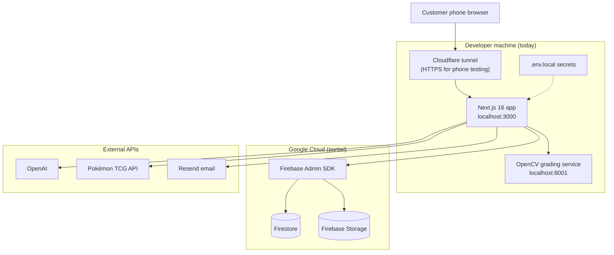
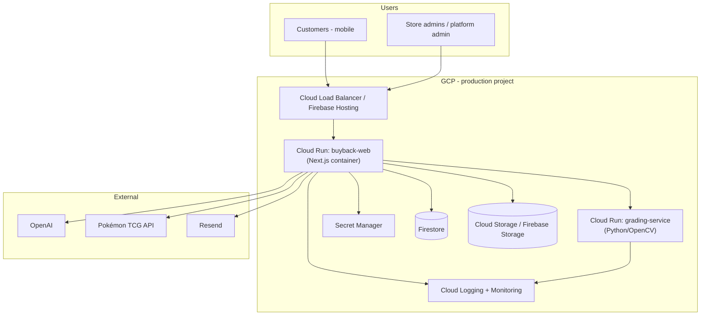

# Trading Card Buyback Platform — Executive Status & Cloud Roadmap

**Prepared for:** CTO, Lead Application Manager  
**Date:** June 25, 2026  
**Project:** Trading Card Buyback Scanner (repo: `cards`)  
**GCP project (dev):** `trading-card-buyback-dev`

---

## 1. Executive summary

We have a **working V1 product** — a mobile-first buyback scanner with AI card identification, store admin dashboard, and multi-store foundations — running primarily on a **local development machine**. The **data layer is partially on Google Cloud** (Firestore + Firebase Storage via Firebase Admin SDK), but the **application server, secrets, and supporting services are not yet deployed**.

**Recommendation:** Move the Next.js application to **Google Cloud Run** (containerized), keep **Firestore + Storage** as the persistence layer, deploy the **OpenCV grading microservice** as a second Cloud Run service, and introduce a **separate production GCP project** with Secret Manager, CI/CD, and hardened security rules. This aligns with existing Firebase/GCP investment and avoids a platform split.

**Estimated effort to first cloud staging environment:** 2–3 weeks (1 engineer, part-time ops support).  
**Estimated effort to production-ready pilot (The Game Lodge):** 4–6 weeks total.

---

## 2. What the product does today

### Customer experience (mobile web)

| Capability | Status |
|------------|--------|
| Store-branded landing page + QR entry (`/s/{store-slug}`) | ✅ Built |
| Customer sign-up (name, email, phone) | ✅ Built |
| Camera capture — front + back photos per card | ✅ Built |
| Raw / graded / unknown item types | ✅ Built |
| Multi-card orders with order numbers (`BB-000001`) | ✅ Built |
| Order status tracking | ✅ Built |

### AI & pricing pipeline

| Capability | Status |
|------------|--------|
| OpenAI GPT-4o vision — card name, set, collector number | ✅ Built (requires `OPENAI_API_KEY`) |
| Identity verification — photo vs catalog art | ✅ Built |
| Live pricing — Pokémon TCG API, Scryfall, YGOProDeck | ✅ Built |
| Store buyback rules applied to offers | ✅ Built |
| Condition pre-grade (centering, corners, edges, surface) | ✅ Built — **requires local Python service** |
| Full admin analysis + GPT buyback report | ✅ Built |

### Admin dashboard

| Capability | Status |
|------------|--------|
| Email/password login (session cookies) | ✅ Built |
| Multi-tenant: platform admin + per-store owners | ✅ Built |
| Store settings, logo, QR code, notification prefs | ✅ Built |
| Account management — change email & password | ✅ Built |
| Order review — approve / reject / edit / do-not-buy | ✅ Built |
| Buyback rules, percentages, conditions | ✅ Built |
| Customer list | ✅ Built |

**Pilot store:** The Game Lodge (`the-game-lodge`) — owner login `lodge1@gmail.com`.

---

## 3. Current architecture



### What runs where

| Component | Location today | Persistent? |
|-----------|----------------|-------------|
| Next.js web + API routes | Local `npm run dev` | No |
| Firestore database | GCP `trading-card-buyback-dev` | Yes |
| Card image storage | Firebase Storage (when configured) | Yes |
| Admin/customer data | Firestore or in-memory fallback | Depends on env |
| OpenCV grading service | Local Docker / Python | No |
| HTTPS for mobile camera | Cloudflare quick tunnel (dev only) | No |
| Secrets (API keys, service account) | `.env.local` on dev machine | ⚠️ Risk |

**Important:** If Firebase Admin credentials are missing, the app silently falls back to **in-memory storage** — data is lost on restart. Production must require Firestore.

---

## 4. Google Cloud — what’s already in place

| GCP / Firebase product | Status | Notes |
|------------------------|--------|-------|
| Firebase project `trading-card-buyback-dev` | ✅ Created | Dev environment |
| Firestore | ✅ Configured | Collections: stores, orders, cards, customers, adminUsers, etc. |
| Firebase Storage | ✅ Configured | Card photos uploaded via Admin SDK |
| Firebase Admin service account | ✅ In use locally | Should move to Secret Manager / workload identity in prod |
| `firestore.rules` + `storage.rules` | ⚠️ Partially deployed | Rules exist in repo; need prod deploy + updates for new collections |
| `firebase.json` | ⚠️ Scaffold only | Hosting points to `web/out` + `nextjs` function — **not wired for current Next.js App Router** |
| Cloud Functions | ⚠️ Placeholder | `onOrderSubmitted` trigger only logs; processing runs in Next.js API |
| Cloud Run | ❌ Not deployed | Recommended target for app + grading service |
| Secret Manager | ❌ Not used | Secrets in local `.env.local` |
| CI/CD | ❌ None | Manual deploy only |
| Production GCP project | ❌ None | Dev project used for everything |
| Custom domain / SSL | ❌ None | Tunnel used for dev HTTPS |
| Monitoring / alerting | ❌ None | No Cloud Logging dashboards or uptime checks |

---

## 5. Gaps blocking a cloud launch

### Critical (must fix before production)

1. **Application hosting** — Next.js with ~40 API routes needs a Node server (Cloud Run or Firebase App Hosting), not static export alone.
2. **Environment separation** — Dev and prod should use separate GCP projects; rotate any credentials that lived in local env files.
3. **Secrets management** — Move `OPENAI_API_KEY`, `FIREBASE_SERVICE_ACCOUNT_KEY`, `ADMIN_SESSION_SECRET`, etc. to **Secret Manager**; never bake into images.
4. **`NEXT_PUBLIC_APP_URL`** — Must be the production HTTPS URL for QR codes and email links.
5. **Firestore security rules** — Update rules for `stores`, `adminUsers`, multi-store `storeSettings`; deploy in production mode (not test mode).
6. **Grading service** — Deploy `services/grading-service` to Cloud Run; set `GRADING_SERVICE_URL` in the main app.

### Important (before store pilot)

7. **Email** — Configure Resend with verified domain for customer/owner notifications.
8. **Admin session secret** — Production `ADMIN_SESSION_SECRET` (distinct from legacy `ADMIN_SECRET`).
9. **Health checks** — `/api/health/firestore` exists; add grading service health + uptime monitoring.
10. **Backup & recovery** — Firestore export schedule; document restore procedure.

### Nice-to-have (V1.1)

11. **CI/CD** — GitHub Actions → Cloud Build → Cloud Run on merge to `main`.
12. **Async processing** — Move long OpenAI pipelines to Cloud Tasks or Pub/Sub to avoid HTTP timeouts.
13. **Cost controls** — OpenAI usage caps, Cloud Run min instances = 0 for dev.

---

## 6. Recommended target architecture (Google Cloud)



### Why Cloud Run (vs alternatives)

| Option | Fit | Verdict |
|--------|-----|---------|
| **Cloud Run** | Full Next.js App Router + API routes, Docker, auto-scale, native GCP IAM | ✅ **Recommended** |
| Firebase App Hosting | Next.js-native, Firebase integration | ✅ Good alternative if team prefers Firebase console workflow |
| Firebase Hosting + Functions | `firebase.json` expects static `web/out` + SSR function — needs significant rework | ⚠️ Possible but more friction |
| Vercel | Excellent Next.js DX | ❌ Splits stack away from GCP data layer |
| GKE | Kubernetes | ❌ Over-engineered for V1 |

---

## 7. Phased roadmap

### Phase 1 — Staging on Cloud (Weeks 1–2)

**Goal:** App reachable at a stable HTTPS URL; data persists in Firestore.

| Task | Owner | Output |
|------|-------|--------|
| Add `Dockerfile` for Next.js (standalone output) | Engineering | Container builds locally |
| Create **staging** Cloud Run service | Engineering / Ops | `https://buyback-staging-*.run.app` |
| Wire env vars via Secret Manager | Ops | No secrets in repo or image |
| Set `NEXT_PUBLIC_APP_URL` to staging URL | Engineering | QR codes work |
| Deploy Firestore + Storage rules | Engineering | `firebase deploy --only firestore:rules,storage` |
| Smoke test: customer scan → admin review | QA / Product | End-to-end on staging |

### Phase 2 — Production project & pilot (Weeks 3–4)

**Goal:** The Game Lodge live on production URL.

| Task | Owner | Output |
|------|-------|--------|
| Create `trading-card-buyback-prod` GCP project | Ops | Isolated prod data |
| Custom domain + SSL (e.g. `buyback.thegamelodge.com`) | Ops | Branded URL |
| Deploy grading service to Cloud Run | Engineering | Full analysis works in cloud |
| Configure Resend + domain verification | Ops | Email notifications |
| Firestore backup schedule | Ops | Daily exports |
| Load / security review | Security / CTO | Sign-off for pilot |

### Phase 3 — Operational maturity (Weeks 5–6)

**Goal:** Safe to onboard additional stores.

| Task | Owner | Output |
|------|-------|--------|
| GitHub Actions → Cloud Build → Cloud Run | Engineering | Automated deploys |
| Cloud Monitoring dashboards + alerts | Ops | Uptime, error rate, latency |
| OpenAI cost monitoring | Engineering | Usage alerts |
| Runbook: deploy, rollback, incident response | Engineering | Ops documentation |
| Pen test / rules audit for multi-tenant isolation | Security | Store data isolation verified |

### Phase 4 — Scale & optimize (Post-pilot)

- Cloud Tasks for async order processing (avoid 60s Cloud Run timeouts on large orders)
- CDN for static assets; image resize pipeline
- Firebase Auth for customers (optional — currently custom email/password in Firestore)
- Per-store billing / usage metering if SaaS model

---

## 8. Decisions needed from leadership

| # | Decision | Options | Recommendation |
|---|----------|---------|----------------|
| 1 | Primary compute platform | Cloud Run vs Firebase App Hosting | **Cloud Run** — already have Docker for grading; one pattern for all services |
| 2 | Environment strategy | Single GCP project vs dev/staging/prod | **Three projects** (dev exists; add staging + prod) |
| 3 | Domain & branding | `*.web.app` vs custom domain | **Custom domain** for Game Lodge pilot |
| 4 | OpenAI budget | Monthly cap / model choice | Set budget alerts; keep GPT-4o for vision accuracy |
| 5 | Pilot scope | Game Lodge only vs multi-store day one | **Game Lodge first**, platform admin ready for store #2 |
| 6 | Compliance | PII (customer email/phone/photos) retention policy | Define retention + deletion before prod |
| 7 | Who owns GCP billing & IAM | Central IT vs product team | Assign before prod project creation |

---

## 9. Rough cost estimate (monthly, pilot scale)

Assumes ~100 orders/month, ~500 card photos, low admin traffic.

| Service | Estimate |
|---------|----------|
| Cloud Run (web + grading, scale-to-zero) | $5–30 |
| Firestore reads/writes | $5–20 |
| Firebase Storage (~5 GB) | $1–5 |
| Cloud Logging | $0–10 |
| OpenAI API (vision + reports) | **$50–300** (usage-dependent) |
| Resend email | $0–20 |
| Custom domain | ~$12/year |

**Dominant variable cost:** OpenAI usage per scanned card. Recommend usage dashboard before wide rollout.

---

## 10. Risk register

| Risk | Impact | Mitigation |
|------|--------|------------|
| Secrets exposed in local env / git | High | Secret Manager; rotate keys; audit `.gitignore` |
| In-memory fallback in prod | High | Fail startup if Firestore unavailable |
| Cloud Run request timeout (60 min max, practical ~few min for UX) | Medium | Async processing for full analysis |
| Firestore rules out of sync with app | High | Deploy rules in CI; add integration tests |
| OpenAI cost spike | Medium | Rate limits, caching, admin-only full analysis |
| Single-engineer bus factor | Medium | Document deploy runbook; CI/CD |

---

## 11. Immediate next steps (this week)

1. **Ops:** Create staging GCP project (or staging Cloud Run in dev project as interim).
2. **Engineering:** Add production `Dockerfile` + `next.config` standalone output for Next.js.
3. **Engineering:** Deploy grading service container to Cloud Run staging.
4. **Ops:** Migrate secrets from `.env.local` to Secret Manager; **rotate OpenAI and Firebase keys** that were on a dev machine.
5. **Product:** Confirm Game Lodge pilot URL and Resend sender domain.
6. **All:** Schedule 30-min architecture review with CTO to confirm Cloud Run vs App Hosting.

---

## 12. Appendix — technical inventory

### Repository structure

```
cards/
├── web/                      # Next.js 16 — customer + admin UI, all API routes
├── services/grading-service/ # Python FastAPI + OpenCV (Dockerfile ready)
├── functions/                # Firebase Functions (placeholder trigger only)
├── firebase.json             # Hosting + Firestore + Storage config
├── firestore.rules
└── storage.rules
```

### Key environment variables (production)

| Variable | Purpose |
|----------|---------|
| `NEXT_PUBLIC_APP_URL` | Public HTTPS URL for QR codes |
| `FIREBASE_PROJECT_ID` / service account | Firestore + Storage |
| `ADMIN_SESSION_SECRET` | Admin cookie signing |
| `OPENAI_API_KEY` | Card vision + reports |
| `POKEMON_TCG_API_KEY` | Live pricing |
| `GRADING_SERVICE_URL` | Cloud Run URL for grading service |
| `RESEND_API_KEY` / `EMAIL_FROM` | Notifications |

### V1 success criteria

All 17 original build-plan criteria are implemented in code. **Cloud deployment is the remaining work** to move from “demo on developer laptop” to “pilot in production.”

---

*Questions or walkthrough demo available on request.*
