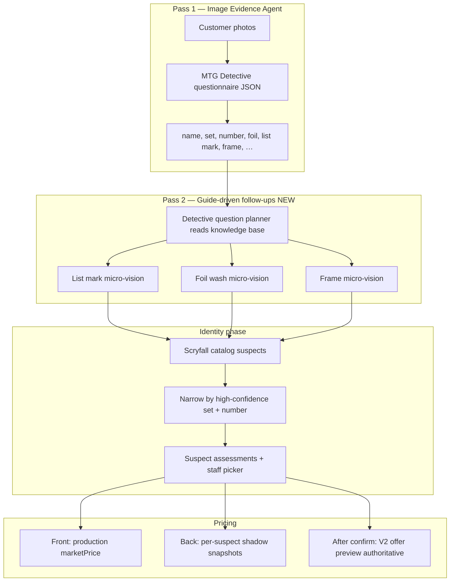

# V2 Flip-Card Clerk UI — Design Repair Report

**Audience:** Dev manager / engineering leadership  
**Date:** 2026-07-06  
**Environment:** Staging (`buyback-web-staging`) — not production  
**Staging URL:** https://buyback-web-staging-rrogeqxyea-uc.a.run.app  
**Latest web revision at time of writing:** `buyback-web-staging-00149-msk`

---

## 1. Purpose of this document

We discovered a **design drift** between what the V2 clerk flip-card UI was **intended** to do and what the backend pipeline was **actually** doing. That mismatch produced confusing clerk experiences on real orders (wrong prices front vs back, empty suspect lists, List printings missed, running totals wrong).

This report explains:

1. The **intended flip-card design** (front vs back responsibilities)
2. Where implementation **diverged** from that design
3. What we **repaired** and what is **still in flight**
4. How the pieces fit together now so the team can align on one mental model

---

## 2. Intended design — the flip card

The clerk mobile review experience is built around a **physical card metaphor**: one card flips between two faces.

### Front face — “What did we read from the photo?”

**Purpose:** Quick scan identity + recommendation + estimate pricing **before** the clerk commits to a printing.

**Shows:**

| UI element | Data source |
|------------|-------------|
| Card name | V2 evidence → `card.detectedName` |
| Game (Magic, Pokémon, …) | Category classification |
| Set name | Evidence slot `set_name` / vision |
| Collector number | Evidence slot `collector_number` |
| Recommendation | V2 offer preview + store rules |
| Condition | Condition estimate / slab |
| Market / Cash / Trade | **Production pipeline pricing** until printing confirmed |
| “Select version” button | Flips to back |

**Key design rule:** Front pricing is an **estimate from the scan**. It should use the **production market run** (multi-source comps, store rules applied downstream). It must **not** blindly show unconfirmed suspect snapshot medians from the back.

Copy on front when identity is pending:

> *Estimate from scan — tap Select version to confirm printing.*

### Back face — “Which exact printing is this?”

**Purpose:** Staff confirms the **exact catalog printing** (set + number + finish + treatment) from a suspect list.

**Shows:**

| Section | Purpose |
|---------|---------|
| **Select version / Confirm printing** | Suspect picker — Scryfall/catalog printings scored against image evidence |
| **Per-suspect shadow median** | “If this printing” V2 market research preview |
| **Price summary** | V2 offer preview after confirmation |
| **Staff action** | Accept / manager review / store rule blocks |

**Key design rule:** Back is **decision-oriented**. Suspect rows are labeled as **candidates**, not authoritative price. Production price stays on front until staff taps a printing.

### Flip interaction

- **Front → Back:** “Select version” (`flipToReview`)
- **Back → Front:** “Back to summary” header (`flipToFront`)
- **Confirm printing:** Optimistic flip to front with confirmed suspect; API persists selection
- Implementation: `CardFlowV2MobileReviewCard.tsx` + `ReviewFlipCard3D` / `ReviewFlipCard2D` fallback

---

## 3. Intended pipeline — how front and back get their data

The flip card only works if **evidence → identity → market → offer** follow one coherent story.



### Knowledge base role (what product expected)

Each category has a **Detective Guide** (`detective-guides.ts`, `knowledge/mtg.ts`, admin V2 Knowledge page):

- **Important regions** — where to look on the card
- **Key fields** — JSON slots the vision agent must fill
- **Variant traps** — known ways the same name maps to different products
- **Lock requirements** — what must be confirmed before auto-lock
- **Staff tips** — how to disambiguate

**Product intent:** The detective uses this guide to **ask questions and narrow the field** — not to dump 12 Scryfall rows and ask the clerk to guess.

**Pokémon already worked this way** for foil (`refinePokemonFoilEvidence` — pass 2 when finish uncertain).

**MTG was missing** an equivalent pass-2 question tree until 2026-07-06 repairs.

---

## 4. What went wrong — symptoms on real orders

### 4.1 Front vs back price disagreement (BB-000024 — Anticausal Vestige)

| Location | Value | Source |
|----------|-------|--------|
| **Front** | ~$9.93 | Production `marketPrice` (multi_source) — **correct for nonfoil** |
| **Back (suspect row)** | ~$24.19 | Shadow `valueMedian` on **foil** suspect before confirmation |

**Mistake we made temporarily:** A UI fix **forced the front to match the back** suspect snapshot median when identity was pending. That was the **wrong direction** — the front production price was right; the back foil snapshot was misleading.

**Repair:** Reverted snapshot-on-front override in `clerk-card-insights.ts`. Front stays on production until printing confirmed.

### 4.2 Empty suspect list after reprocess (BB-000023 — Yuriko)

**Symptom:** Back face showed “Pick the exact version” with **zero suspects**.

**Root cause:** Scryfall catalog returned **0 matches** on Cloud Run (transient failure / silent empty). Evidence was fine (name, C18, 052/307 all extracted). Pipeline had **no recovery path** and **wiped** the previous suspect list.

**Repairs:**

- Scryfall client retries (429/5xx/network)
- Catalog search retries (3 attempts)
- `recoverMtgCatalogSuspects()` fallback (name search + plst)
- Reprocess retains previous suspects if new catalog fails

### 4.3 The List not detected (BB-000023 — Yuriko on The List)

**Symptom:** Yuriko has a **List** printing (`plst`, e.g. C18-52). Fork symbol on bottom-left. System did not surface plst suspect.

**Root cause (architecture, not vision):**

1. Pass 1 **does** include `the_list_mark` in the questionnaire.
2. **List Mark Inspector** (micro-vision crop) only ran when a **catalog trap** fired — i.e. Scryfall already returned **both** a `plst` suspect **and** an origin suspect.
3. If catalog never returned `plst`, the fork inspector **never ran** — even if pass 1 saw the symbol.

**This inverted the design:** Catalog drove vision follow-ups instead of **evidence driving catalog**.

**Repairs:**

- Evidence-driven List investigation (`mtg-list-evidence.ts`)
- Inject `plst` suspects when guide/evidence triggers List path
- **Guide-driven question planner** — pass 2 always re-checks List fork when collector line is readable and pass-1 answer isn’t micro-vision confirmed

### 4.4 Running total / footer wrong (BB-000021)

**Symptom:** Card face showed ~$39 V2 preview; order footer ~$8.

**Root cause:** Footer summed stale `card.marketPrice` / `card.cashOffer` instead of clerk display amounts.

**Repair:** `resolveClerkRunningOfferAmounts()` unified with card face logic.

### 4.5 Store rules / border color (BB-000024)

**Symptom:** Store rule should block buy; border stayed green.

**Root cause:** Rules loaded for wrong store; `approved` status forced green even when identity pending.

**Repair:** Rules via order `storeId`; border uses `storeRuleBlock`; don’t auto-green on `approved` when identity not confirmed.

### 4.6 Too many suspects when set + number were obvious

**Symptom:** 12+ Yuriko printings when photo clearly said C18 #052.

**Root cause:** Matcher scored/penalized but didn’t **hard-filter** on high-confidence set + collector number.

**Repair:** `narrowSuspectsByObservedSetAndNumber()` when set+# observed ≥75% confidence (skipped during active List investigation).

---

## 5. Design repairs — chronological summary

| Date / phase | Change | Why |
|--------------|--------|-----|
| Tier 1–2 perf | Parallel card processing, min-instances, job 4 CPU | Orders timing out on Cloud Run |
| Running totals | `resolveClerkRunningOfferAmounts` | Footer matched card face |
| Card face pricing | Show pricing when scan data exists, not only after staff confirm | Front was blank too often |
| **Wrong fix (reverted)** | Front = top suspect snapshot median | Made Anticausal worse |
| List evidence path | `mtg-list-evidence`, `mtg-plst-candidates` | Evidence triggers List, not catalog trap |
| Set+# narrow | `narrowSuspectsByObservedSetAndNumber` | Collapse obvious printings |
| Catalog recovery | Scryfall retry + `recoverMtgCatalogSuspects` | Empty suspect list on reprocess |
| **Guide-driven detective** | `detective-question-planner`, `mtg-variant-evidence` | Knowledge base drives pass-2 questions |
| Pass 1 prompt | Full MTG guide in evidence agent intro | Detective reads same knowledge staff sees |

---

## 6. Current architecture (post-repair)

### 6.1 Evidence phase (`run-card-evidence-v2.ts`)

1. Category classifier  
2. **Pass 1:** Image evidence agent → JSON slots (name, set, number, foil, `the_list_mark`, …)  
3. **Pass 2 (MTG):** `planMtgDetectiveQuestions(guide, evidence)` → micro-vision inspectors  
4. Saves `detectiveQuestions[]` on evidence bundle for audit  

### 6.2 Identity phase (`run-card-identity-v2.ts`)

1. Catalog candidates (with retry + recovery)  
2. If MTG + 0 suspects → `recoverMtgCatalogSuspects`  
3. List investigation → inject `plst` if triggered  
4. List / foil / frame inspectors (guide **or** catalog trap; skip if pass 2 resolved)  
5. Narrow suspects by set+# when confident  
6. Suspect assessments → staff picker on **back of flip card**  

### 6.3 Clerk UI pricing rules (`clerk-card-insights.ts`)

| State | Front market | Back suspect row |
|-------|--------------|------------------|
| Identity **pending** | `card.marketPrice` (production) | Shadow median labeled as preview |
| Identity **confirmed** | V2 offer preview | Promoted snapshot for chosen suspect |

### 6.4 Key files (for code review)

| Area | Files |
|------|-------|
| Flip UI | `CardFlowV2MobileReviewCard.tsx`, `review-flip-card/*` |
| Clerk pricing | `clerk-card-insights.ts`, `clerk-recommendation.ts` |
| Evidence pass 1 | `image-evidence-agent.ts`, `knowledge/mtg.ts` |
| Question planner | `detective-question-planner.ts`, `mtg-variant-evidence.ts` |
| List path | `mtg-list-evidence.ts`, `mtg-plst-candidates.ts`, `mtg-list-mark-inspector.ts` |
| Catalog | `catalog-candidates.ts`, `scryfall-client.ts`, `pricing.ts` |
| Identity orchestration | `run-card-identity-v2.ts`, `run-card-evidence-v2.ts` |
| Knowledge admin UI | `admin/v2/knowledge/page.tsx` |

---

## 7. What we are aligned on now (design contract)

1. **Front = read from photo + production estimate.** Name/set/number come from the same evidence JSON the detective fills. Pricing uses production until staff confirms.

2. **Back = choose printing.** Suspect list is guide-narrowed. Shadow prices are **hypothetical** (“if this printing”).

3. **Detective uses the knowledge base.** Pass 1 questionnaire + pass 2 targeted questions (List fork, foil, frame). Not “Scryfall first, questions maybe.”

4. **High-confidence set + number narrows suspects.** Finish/treatment/List disambiguate among remaining variants.

5. **List detection:** Fork symbol question → micro-vision → inject `plst` → staff picks plst vs origin.

6. **Flip card is the primary clerk workflow.** 3D flip with 2D fallback; confirm printing flips back to front with updated recommendation.

---

## 8. Known gaps / not done yet

| Item | Status |
|------|--------|
| Directive 008 full sign-off | V2-primary job deployed; timing reports need clean run post-fixes |
| Production rollout | Staging only — V1 code retained |
| Pokémon / YGO / Sports guide-driven pass 2 | MTG only today; Pokémon has foil pass 2 |
| Reprocess all affected orders | BB-000023, BB-000024 need reprocess on staging to validate |
| Admin knowledge page vs runtime | Guide content drives prompts; ensure KB edits are reviewed before deploy |
| E2E test for flip + List + pricing | Unit scripts exist; no full Playwright flip flow yet |

---

## 9. How to validate on staging

1. Open order **BB-000023** (Yuriko) or submit a new List card photo.  
2. **Front:** Name, Commander 2018, #052/307, production market estimate.  
3. Tap **Select version** → flip to back.  
4. **Back:** Suspect list includes C18 + **plst** candidates; List inspection notes if fork checked.  
5. Confirm printing → flip to front → V2 preview pricing authoritative.  
6. Order footer total matches sum of card faces.  

**Reprocess:** Admin order page → “Reprocess cards” (runs V2-primary path with new detective logic).

**Inspect scripts:**

```powershell
cd web
npx tsx scripts/inspect-order-identity.ts BB-000023
npx tsx scripts/inspect-order-evidence-dump.ts BB-000023
npx tsx scripts/test-detective-question-planner.ts
```

---

## 10. Glossary

| Term | Meaning |
|------|---------|
| **Evidence bundle** | Pass 1+2 vision JSON on the card (`cardFlowV2Evidence`) |
| **Identity bundle** | Suspects + assessments + lock state (`cardFlowV2Identity`) |
| **Suspect** | One catalog printing candidate (e.g. Yuriko C18 #52 foil) |
| **Shadow snapshot** | V2 market research for a suspect — not production price |
| **Production fields** | `marketPrice`, `cashOffer`, `tradeOffer` on `ScannedCard` |
| **Offer preview** | V2 clerk-facing estimate (`cardFlowV2OfferPreview`) |
| **Detective guide** | Category knowledge base (traps, tips, lock rules) |
| **plst** | Scryfall set code for “The List” reprints |
| **List mark** | Small Planeswalker/fork icon bottom-left on List copies |

---

## 11. One-paragraph summary for leadership

The flip-card clerk UI was designed so the **front** shows what vision read from the photo plus a **production price estimate**, and the **back** lets staff pick the exact printing from guide-narrowed suspects. We drifted: pricing logic temporarily tied the front to unconfirmed back snapshots; List detection waited for Scryfall instead of asking the vision detective the questions in our MTG knowledge base; and catalog failures could zero out the suspect list. Repairs realign the pipeline with the design — evidence and knowledge base drive targeted follow-up questions, catalog is recovery-hardened, front/back pricing roles are restored, and the flip card again matches the intended “summary → confirm printing → summary” flow.

---

*Questions / review: engineering — refer to commit history on staging branch and revision `buyback-web-staging-00149-msk`.*
